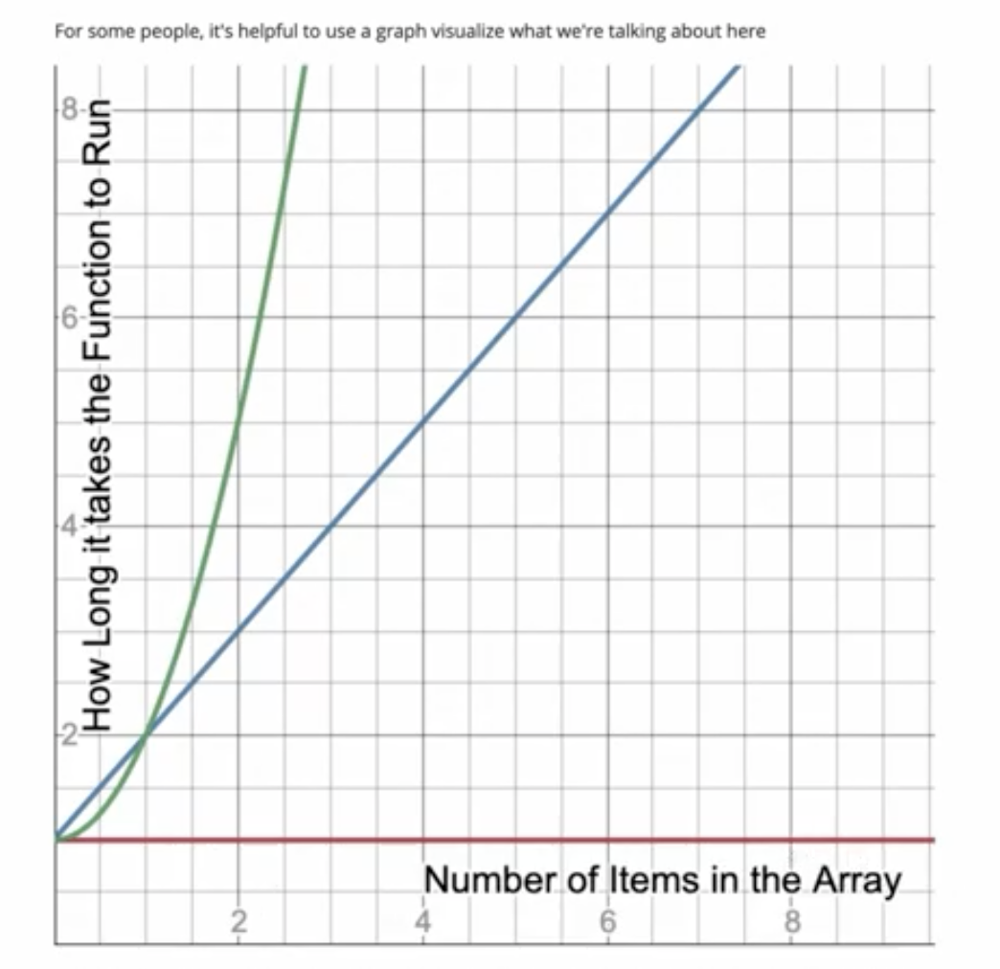

# BigO

A way to analyse code's efficiency (in computer science) w/ out getting to bogged down in the details.

Take the below expression:

`3x^2 + x + 1`

We can say everything between the operators is a '**Term**'

The life hack here is to find the biggest term, in this example, `3X^2` and remove the coefficient - leaving us with X^2 - we use n in place of x w/ bigO - leaving us with O(n2)

## Code Example

### O(n) - Linear Time

> how does this algorithm scale as the argument we pass to the parameter 'input' increases - i.e. an array 5 elements long vs an array 1 million elements long???

```js
const crossAdd = (input) => {
  let result = [];
  for (let i = 0; i < input.length; i++) {
    let goingUp = input[i];
    let goingDown = input[input.length - 1 - i];
    result.push(goingUp + goingDown);
  }
  return result;
};
```

The trick is to look for loops - in this example, we have one return statement and a four loop that iterates over the input elements one time

this would be O(n) - i.e. time is constant to the number of inputs. Once each

You might ask, "what about the code within the four loop - what if we add a ton of work inside of it, how would that impact our complexity?

```js
let goingUp = input[i];
let goingDown = input[input.length - 1 - i];
result.push(goingUp + goingDown);
```

☝️ this would be the coefficient. `3X^2` in the example above - it could grow with more logic inside the loop but, for BigO, we drop the coefficient and focus on the loops

What about this one?

```js
function find(needle, haystack) {
  for (var i = 0; i < haystack.length; i++) {
    if (haystack[i] === needle) return true;
  }
}
```

Still O(n)

But what if it finds the needle in the haystack on element index 1?

There is a difference between _Best Case_, _Middle Case_, and _Worst Case_

Unless we say otherwise, we're going to assume worst case when speaking of BigO

### O(n2) - Quadratic Time

Here is a good example of O(n2)

In this code example, we iterate through an input and loop through it again to make a tuple from each of the possible combinations

```js
function makeTuples(input) {
  var answer = [];
  for (var i = 0; i < input.length; i++) {
    for (var j = 0; j < input.length; j++) {
      answer.push([input[i], input[j]]);
    }
  }
  return answer;
}
```

Three nested for loops would be O(n3) which gets out of hand way too quickly; don't write N3 algos

### O(1) - Constant Time

There is no looping here - we're going to just grab the middle element of an array - which means Constant.

A good question to ask is - _does this take more time if the array is longer_?

```js
function getMiddleOfArray(array) {
  return array[Math.floor(array.length / 2)];
}
```

In the image below

- Green = Quadratic Time

- Blue = Linear Time

- Red = Constant Time


